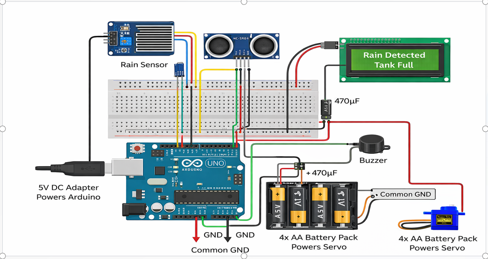
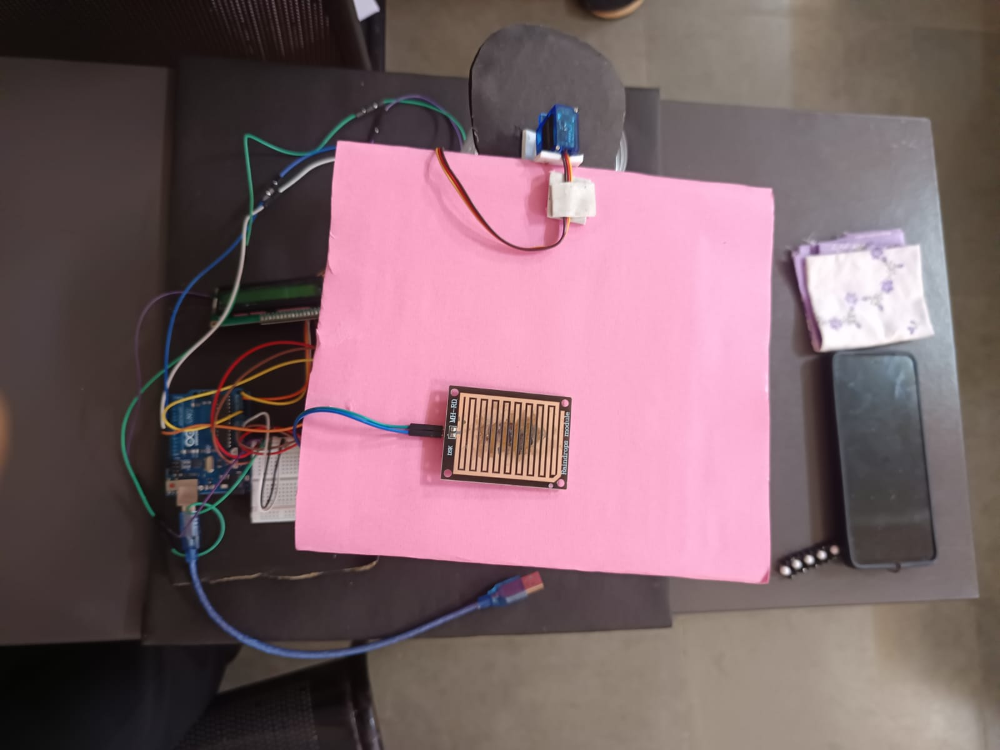
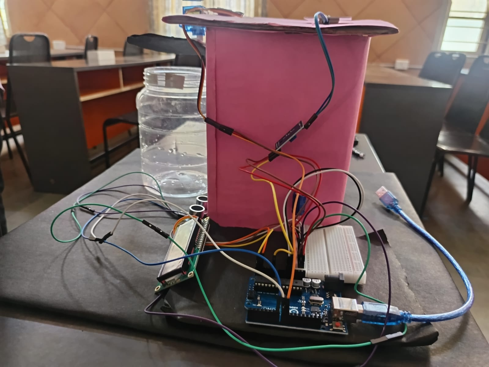

# Smart Rainwater Harvesting System using Arduino

## Project Overview

The Smart Rainwater Harvesting System is an IoT-based project developed using the Arduino microcontroller. It automatically monitors rainfall, water leveland controls the water flow using a servo motor. The system also displays real-time information on a 16x2 I2C LCD.

---

##  Features

- Detects rainfall using a rain sensor
- Measures tank water level using an ultrasonic sensor
- Automatically controls water flow using a servo motor
- Displays system status on a 16x2 I2C LCD
- Arduino-based IoT implementation

---

##  Components Used

- Arduino Uno Development Board
- Rain Sensor
- Ultrasonic Sensor (HC-SR04)
- SG90 Servo Motor
- 16x2 I2C LCD Display
- Breadboard
- Jumper Wires
- Power Supply

---

## Working Principle

1. The rain sensor detects rainfall.
2. The ultrasonic sensor measures the water level inside the storage tank.
3. Based on sensor readings, the Arduino controls the servo motor.
4. The LCD displays:
   - Rain Status
   - Water Level
   - Servo Status

---

## 📷 Project Images

### Circuit Diagram

### Project Setup

---

## 🎥 Project Demo

Watch the demo here:

## 🚀 Future Enhancements

- Mobile App Integration
- Cloud Data Logging
- Notification Alerts
- Water Quality Analytics
- Dashboard Creation

---

## 👩‍💻 Developed By

**Kripashree**

Master of Computer Applications (MCA)
